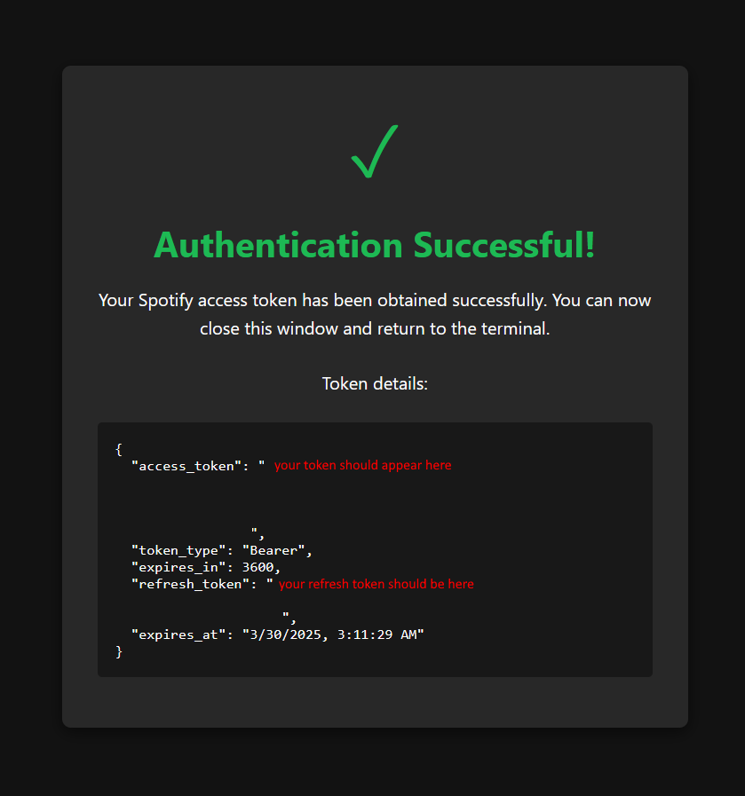

# Spotify Authentication Server

A lightweight TypeScript/Node application for obtaining Spotify API tokens using the OAuth 2.0 Authorization Code flow. This standalone utility simplifies the process of authenticating with Spotify's API, allowing you to easily get the tokens needed for making authorized requests.

For real usefulness this program alone does not do much, and needs to be integrated into a larger application.

<div align="center">



</div>

## Key Features

- **Authorization Code Flow** implementation (more secure than Implicit Grant)
- **Express server** handling OAuth redirects automatically
- **Development & Production modes** with environment-specific configurations
- **CSRF protection** using state verification
- **Automatic browser launch** in development mode
- **Separate token storage** for development and production

## Prerequisites

- Node.js 16+ installed
- Spotify Developer account with a registered application
- Redirect URIs registered in your Spotify Developer Dashboard

## Quick Start

1. **Clone and install dependencies**

   ```bash
   git clone [repository-url]
   cd spotify-authentication-server
   npm install
   ```

2. **Configure your environment**
   Create a `.env` file with:

   ```environment
   # Spotify API credentials
   SPOTIFY_CLIENT_ID="your-client-id"
   SPOTIFY_CLIENT_SECRET="your-client-secret"
   SPOTIFY_REDIRECT_URLS="http://localhost:3030/api/spotify/callback, https://your-production-domain.com/api/spotify/callback"
   # CSRF protection
   SPOTIFY_STATE="your-random-state-string" # Optional for production
   # Server configuration
   PORT=3030
   ```

3. **Run the server**

   ```bash
   # Development mode (uses first URL, opens browser)
   npm start
   
   # Production mode (uses second URL)
   npm run start:prod      # Linux/Mac
   npm run start:prod:win  # Windows
   ```

## Usage Modes

### Development Mode

Uses localhost redirect URI, automatically opens your browser, and saves tokens to `spotify-tokens-dev.json`.

### Production Mode

Uses your production domain redirect URI, requires manual browser navigation, and saves tokens to `spotify-tokens-prod.json`.

## VS Code Integration

This project includes VS Code configurations for seamless development:

- **Debug configurations** for both development and production modes
- **Task definitions** for common operations
- **Recommended extensions** and editor settings

Open the Run & Debug panel (Ctrl+Shift+D) to access launch configurations or use Terminal → Run Task to access tasks.

## Using the Obtained Tokens

After authentication, you'll receive:

```typescript
// From spotify-tokens-dev.json or spotify-tokens-prod.json
{
  "access_token": "BQDKxeM...", // For API requests
  "token_type": "Bearer",      // Authentication method
  "expires_in": 3600,          // Seconds until expiration
  "refresh_token": "AQCvX...", // For obtaining new access tokens
  "expires_at": "3/30/2025, 2:15:00 PM" // Human-readable expiration
}
```

Example usage in your application:

```typescript
import * as fs from 'fs';

// Read the tokens file
const tokenData = JSON.parse(fs.readFileSync('spotify-tokens-dev.json', 'utf8'));

// Make a request to Spotify API
const response = await fetch('https://api.spotify.com/v1/me', {
  headers: {
    'Authorization': `Bearer ${tokenData.access_token}`
  }
});
```

## Security Considerations

- Store tokens securely and never commit them to version control
- Implement token refresh logic for long-running applications
- Use HTTPS in production environments
- Consider more robust token management for production applications

## Current Limitations

This utility is primarily designed for development and testing. For production applications, consider:

- Implementing proper token refresh mechanisms
- Using a database instead of file storage for tokens
- Adding more robust error handling
- Integrating with a full authentication system
